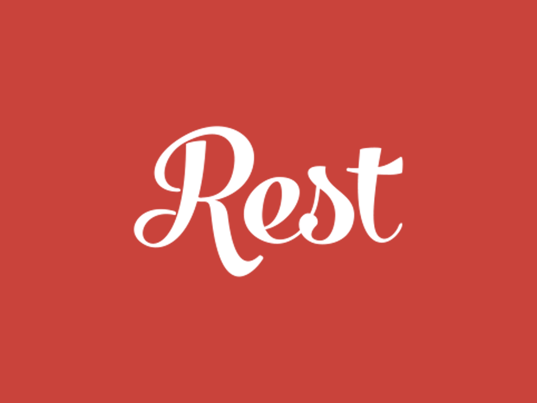
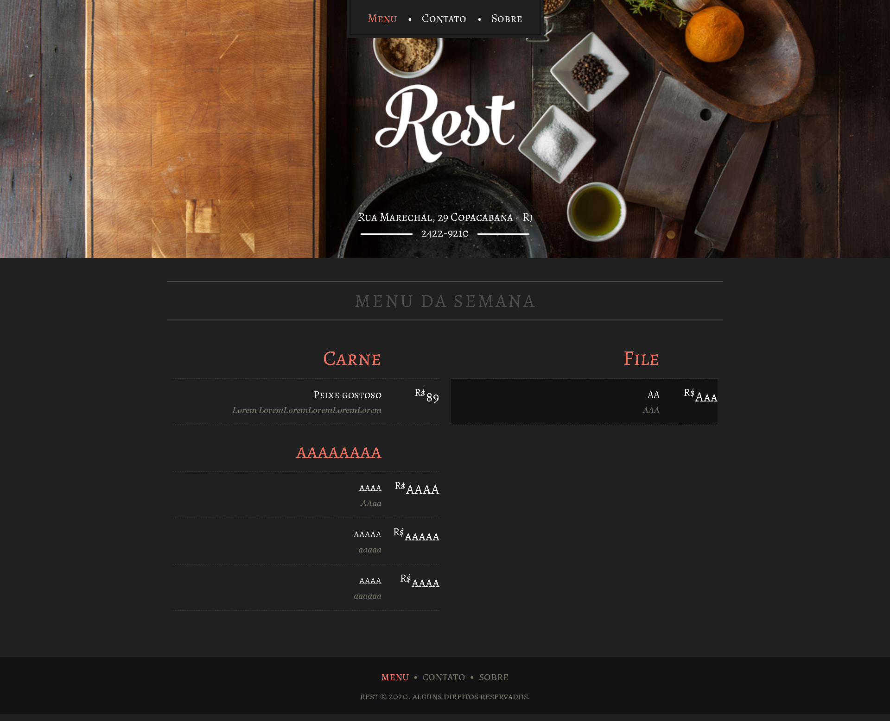
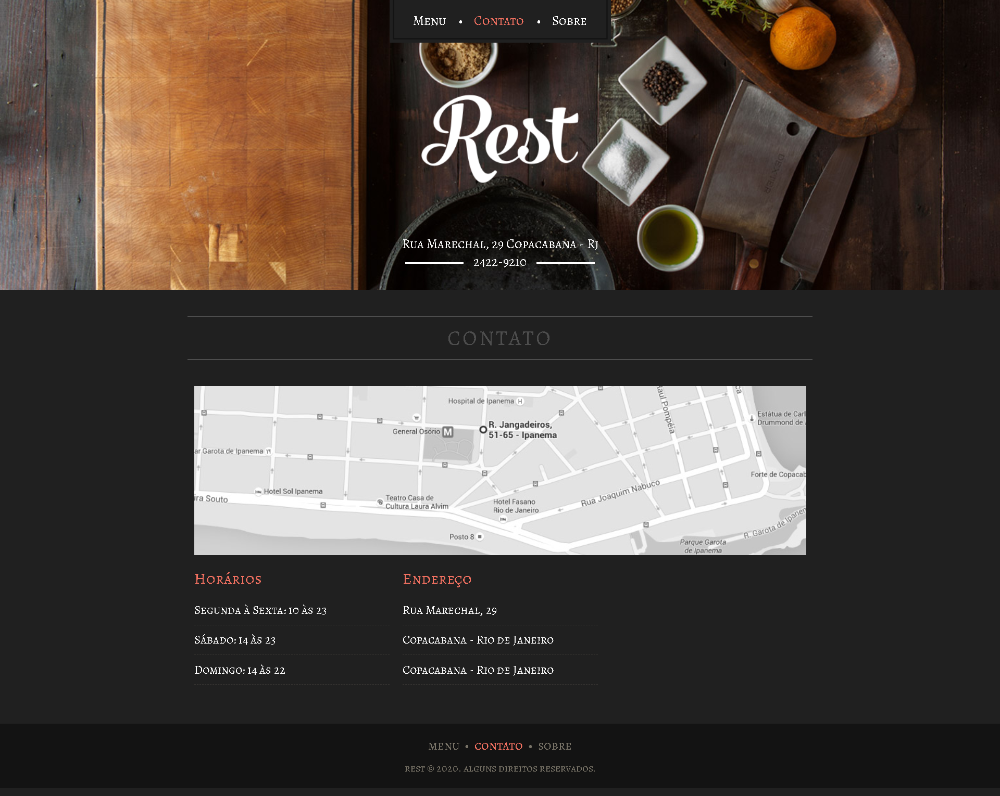
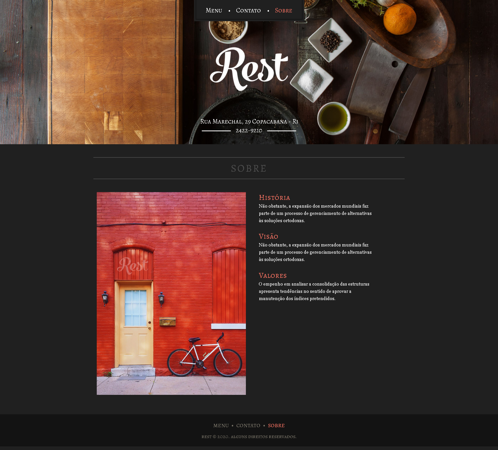

<p align="center">
  

  
  
  <a href="https://github.com/FlavioInacio-jf/site-rest/issues">
    
  </a>
  
  <a href="https://github.com/FlavioInacio-jf/site-rest/stargazers">
    
  </a>
  
  <a href="https://github.com/FlavioInacio-jf/site-rest/blob/master/LICENSE">
   
  </a>
  
</p>
<h1 align="center">
    
</h1>

<h4 align="center"> 
	🚧  Rest ♻️ Concluído 🚀 🚧
</h4>

<p align="center">
 <a href="#-sobre-o-projeto">Sobre</a> •
 <a href="#-funcionalidades">Funcionalidades</a> •
 <a href="#-como-executar-o-projeto">Como executar</a> • 
 <a href="#-tecnologias">Tecnologias</a> • 
 <a href="#-autor">Autor</a> • 
 <a href="#user-content--licença">Licença</a>
</p>


## 💻 Sobre o projeto

♻️ Ecoleta - é uma forma de conectar empresas e entidades de coleta de resíduos orgânicos e inorgânicos as pessoas que precisam descartar seus resíduos de maneira ecológica.


Site desenvolvido durante a **Curso Wordpress como cms** oferecida pela [Origamid](https://www.origamid.com/curso/wordpress-como-cms).

---

## ⚙️ Funcionalidades

- [x] Empresas ou entidades podem se cadastrar na plataforma web enviando:
  - [x] uma imagem do ponto de coleta
  - [x] nome da entidade, email e whatsapp
  - [x] e o endereço para que ele possa aparecer no mapa
  - [x] além de selecionar um ou mais ítens de coleta: 
    - lâmpadas
    - pilhas e baterias
    - papéis e papelão
    - resíduos eletrônicos
    - resíduos orgânicos
    - óleo de cozinha

- [x] Os usuários tem acesso ao aplicativo móvel, onde podem:
  - [x] navegar pelo mapa para ver as instituições cadastradas
  - [x] entrar em contato com a entidade através do E-mail ou do WhatsApp

---

### Web

<p align="center" style="display: flex; align-items: flex-start; justify-content: center;">
  

  
  
  
</p>

---

## 🚀 Como executar o projeto

Este projeto é divido em três partes:
1. Frontend

💡Esse templete é feito para o Wordpress.

### Pré-requisitos

Antes de começar, você vai precisar ter instalado em sua máquina a seguinte ferramenta:
[Local](https://localwp.com/). 
Além disto é bom ter um editor para trabalhar com o código como [VSCode](https://code.visualstudio.com/)


#### 🧭 Rodando a aplicação web

```bash

# Clone este repositório
$ git clone git@github.com:tgmarinho/README-ecoleta.git

# Acesse a pasta do projeto no seu terminal/cmd
$ cd README-ecoleta

# Vá para a pasta da aplicação Front End
$ cd web

# Instale as dependências
$ npm install

# Execute a aplicação em modo de desenvolvimento
$ npm run start

# A aplicação será aberta na porta:3000 - acesse http://localhost:3000

```

---

## 🛠 Tecnologias

As seguintes ferramentas foram usadas na construção do projeto:

#### **Website**  ([React](https://reactjs.org/)  +  [TypeScript](https://www.typescriptlang.org/))

-   **[React Router Dom](https://github.com/ReactTraining/react-router/tree/master/packages/react-router-dom)**
-   **[React Icons](https://react-icons.github.io/react-icons/)**
-   **[Axios](https://github.com/axios/axios)**
-   **[Leaflet](https://react-leaflet.js.org/en/)**
-   **[React Leaflet](https://react-leaflet.js.org/)**
-   **[React Dropzone](https://github.com/react-dropzone/react-dropzone)**

> Veja o arquivo  [package.json](https://github.com/tgmarinho/README-ecoleta/blob/master/web/package.json)

#### [](https://github.com/tgmarinho/Ecoleta#server-nodejs--typescript)**Server**  ([NodeJS](https://nodejs.org/en/)  +  [TypeScript](https://www.typescriptlang.org/))

-   **[Express](https://expressjs.com/)**
-   **[CORS](https://expressjs.com/en/resources/middleware/cors.html)**
-   **[KnexJS](http://knexjs.org/)**
-   **[SQLite](https://github.com/mapbox/node-sqlite3)**
-   **[ts-node](https://github.com/TypeStrong/ts-node)**
-   **[dotENV](https://github.com/motdotla/dotenv)**
-   **[Multer](https://github.com/expressjs/multer)**
-   **[Celebrate](https://github.com/arb/celebrate)**
-   **[Joi](https://github.com/hapijs/joi)**

> Veja o arquivo  [package.json](https://github.com/tgmarinho/README-ecoleta/blob/master/server/package.json)

#### [](https://github.com/tgmarinho/Ecoleta#utilit%C3%A1rios)**Utilitários**

-   Editor:  **[Visual Studio Code](https://code.visualstudio.com/)**  → Extensions:  **[SQLite](https://marketplace.visualstudio.com/items?itemName=alexcvzz.vscode-sqlite)**
-   Fontes:  **[Alegreya SC](https://fonts.google.com/?query=Alegreya+SC)**,  **[Georgia](https://fonts.google.com/?query=Georgia)**


---
## 💪 Como contribuir para o projeto

1. Faça um **fork** do projeto.
2. Crie uma nova branch com as suas alterações: `git checkout -b my-feature`
3. Salve as alterações e crie uma mensagem de commit contando o que você fez: `git commit -m "feature: My new feature"`
4. Envie as suas alterações: `git push origin my-feature`

---

## 🦸 Autor
 
 <br />
 <sub><b>Flávio Inácio</b></sub>
 <br />

[](https://www.linkedin.com/in/fl%C3%A1vio-in%C3%A1cio/) 
[](mailto:jflavioinacio22@gmail.com)

---

## 📝 Licença

Este projeto esta sobe a licença [MIT](./LICENSE).

Feit por Flávio Inácio 👋🏽 [Entre em contato!](https://www.linkedin.com/in/fl%C3%A1vio-in%C3%A1cio/)
